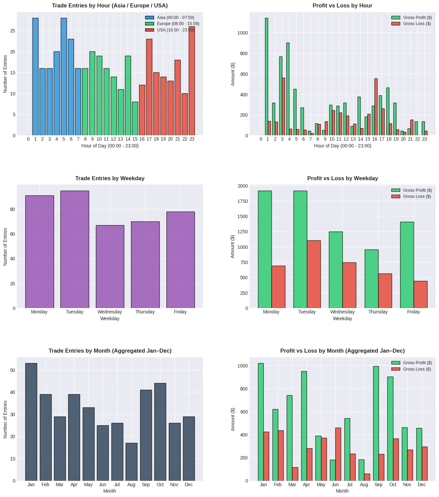

## Executive Summary

A low-capital quantitative trading system for Gold (XAUUSD) engineered to minimize drawdowns and maximize account survival. By running real-time, memory-persisted market simulations alongside technical safety nets, the system achieves strict capital preservation while maintaining robust profitability.

## Core Problem

Retail algorithmic trading systems (Expert Advisors) typically rely on large account balances to absorb high margin calls and liquidity shocks. For smaller capital accounts, standard market volatility and unexpected broker or terminal crashes frequently lead to sudden liquidations and complete loss of strategy trade context.

## Solution

### In-Memory Strategy Simulation Engine
* Engineered an in-memory evaluation mechanism that simulates live strategy execution cycles in sub-millisecond real time.
* Calculates dynamic market state indicators to categorize price action into **Safe** vs. **Unsafe** regimes, executing only low-risk, high-probability trade setups.

### Persistent Memory-State Preservation
* Developed a custom disk-serialization engine that periodically saves internal simulation memory and active strategy parameters.
* Ensures immediate context recovery during unexpected terminal shutdowns, broker disconnections, or system crashes without losing trade history or risk state.

### Multi-Layer Risk Safeguards & Regime Exits
* Integrated adaptive Moving Averages (MA) for trend filtering and Average True Range (ATR) to dynamically measure market volatility.
* Implemented an automated emergency liquidation protocol that systematically closes all open positions when the environment transitions into an **Unsafe** high-risk market regime.

## Backtest Report

General Settings

| Settings | Value |
| :--- | :--- |
| Period | 1 January 2025 - 31 July 2026 |
| Symbol | GOLD (XAUUSD) |
| Company | XM Global Limited |
| Initial Deposit | $1000 USD |
| Leverage | 1:500 |

Top KPI Summary

| Performance Metric | Backtest Result |
| :--- | :--- |
| Profit Factor | 2.08 |
| Max Drawdown | 550.66 (20.69%) |
| Sharpe Ratio | 6.13 |
| Tick Data Quality | 100% |

Full Report

| | | | | | |
| :--- | :--- | :--- | :--- | :--- | :--- |
| Initial Deposit | 1000.00 | | | | |
| Total Net Profit | 3901.23 | Balance Drawdown Absolute | 75.70 | Equity Drawdown Absolute | 81.51 |
| Gross Profit | 7446.88 | Balance Drawdown Maximal | 410.41 | Equity Drawdown Maximal | 550.66 |
| Gross Loss | -3545.65 | Balance Drawdown Relative | 16.14% | Equity Drawdown Relative | 20.69% |
| Profit Factor | 2.10 | Expected Payoff | 9.73 | Margin Level | 4199.64% |
| Recovery Factor | 7.08 | Sharpe Ratio | 6.13 | Z-Score | 99.74% |
| AHPR | 0.41% | LR Correlation | 0.99 | | |
| GHPR | 0.40% | LR Standard Error | 176.03 | | |
| Total Trades | 401 | Short Trades (won %) | 0(0%) | Long Trades (won %) | 401(50.87%) |
| Total Deals | 802 | Profit Trades (% of total) | 204(50.87%) | Loss Trades (% of total) | 197(49.13%) |
| | Largest | Profit Trade | 56.27 | Loss Trade | -45.87 |
| | Average | Profit Trade | 36.50 | Loss Trade | -18.00 |
| | Maximum | Consecutive Wins ($) | 10(342.72) | Consecutive Losses ($) | 17(-363.27) |
| | Maximal | Consecutive Profit (count) | 427.27(9) | Consecutive Loss (count) | -363.27(17) |
| | Average | Consecutive Wins | 5 | Consecutive Losses | 4 |
| Minimal position holding time | 0:03:57 | Maximal position holding time | 86:41:00 | Average position holding time | 15:17:45 |

Charts

## Verification Artifacts

Download the raw backtest execution data to verify trade statistics and drawdowns:

* **[Download Historical Backtest Deals (CSV)](/downloads/golden_sundae_deals.csv)**
* **[Download Historical Backtest Orders (CSV)](/downloads/golden_sundae_orders.csv)**